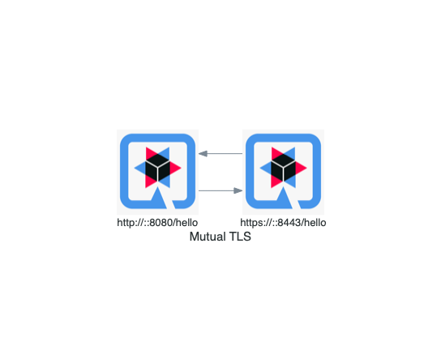

# Quarkus Mutual TLS Quickstart



## Local Deployment

### Build

* JVM 
  ```
  mvn clean package
  ```
* Native
  ```
  mvn clean package -Pnative
  ```

### Run

On Server listening on 8443.

* JVM 
  ```
    java -jar target/rest-server-tck-1.0-SNAPSHOT-runner.jar
  ```
* Native
  ```
    ./target/rest-server-tck-1.0-SNAPSHOT-runner
  ```
 
On Client listening on 8080.

* JVM 
  ```
    java -jar target/rest-client-tck-1.0-SNAPSHOT-runner.jar
  ```
* Native
  ```
    ./target/rest-client-tck-1.0-SNAPSHOT-runner
  ```
  
### Test

```
 curl http://localhost:8080/hello
 hello from server
```

## On Kubernetes / OpenShift

[Deploy](./deploy/README.md)